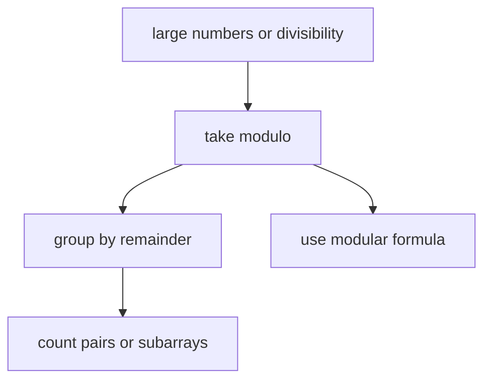

# 26. Modular Arithmetic and Counting

> Modular Arithmetic and Counting은 큰 수를 나머지 class로 줄이고, 같은 나머지끼리 묶어 경우의 수를 세는 패턴이다. 핵심은 **나머지가 같은 값들의 차이는 mod로 나누어떨어진다**는 불변식이다.

## 문제 신호

- answer modulo `1_000_000_007`
- divisible by k
- remainder, parity
- number of subarrays with condition
- combinations count
- very large count
- prefix sum modulo



## 기본 성질

`a % m == b % m`이면 `(a - b) % m == 0`이다. Prefix sum에 적용하면 subarray sum divisibility를 셀 수 있다.

## Prefix Modulo Counting

```python
from collections import defaultdict


def subarrays_divisible_by_k(nums: list[int], k: int) -> int:
    count: dict[int, int] = defaultdict(int)
    count[0] = 1
    prefix = 0
    answer = 0

    for num in nums:
        prefix = (prefix + num) % k
        answer += count[prefix]
        count[prefix] += 1

    return answer
```

불변식: 현재 prefix와 같은 나머지를 가진 이전 prefix를 고르면, 그 사이 subarray sum은 `k`로 나누어떨어진다.

## Pair Counting by Remainder

합이 `k`로 나누어떨어지는 pair를 센다.

```python
def count_pairs_divisible_by_k(nums: list[int], k: int) -> int:
    counts = [0] * k
    answer = 0

    for num in nums:
        r = num % k
        need = (-r) % k
        answer += counts[need]
        counts[r] += 1

    return answer
```

## Modular DP

경우의 수 DP에서는 매 transition마다 mod를 적용해 수가 커지는 것을 막는다.

```python
def count_ways_to_climb(n: int, mod: int) -> int:
    if n <= 1:
        return 1

    prev2, prev1 = 1, 1
    for _ in range(2, n + 1):
        cur = (prev1 + prev2) % mod
        prev2, prev1 = prev1, cur
    return prev1
```

## 조합 전처리

소수 mod에서 factorial과 inverse factorial을 전처리하면 조합 query를 O(1)에 처리할 수 있다.

```python
def prepare_combination(limit: int, mod: int) -> tuple[list[int], list[int]]:
    fact = [1] * (limit + 1)
    inv_fact = [1] * (limit + 1)

    for i in range(1, limit + 1):
        fact[i] = fact[i - 1] * i % mod

    inv_fact[limit] = pow(fact[limit], -1, mod)
    for i in range(limit, 0, -1):
        inv_fact[i - 1] = inv_fact[i] * i % mod

    return fact, inv_fact


def comb_mod(n: int, k: int, fact: list[int], inv_fact: list[int], mod: int) -> int:
    if k < 0 or k > n:
        return 0
    return fact[n] * inv_fact[k] % mod * inv_fact[n - k] % mod
```

## Modular Inverse 주의

`pow(a, -1, mod)`는 inverse가 존재하지 않으면 예외가 날 수 있다. 보통 `gcd(a, mod) == 1`이어야 한다.

```python
from math import gcd


def safe_mod_inverse(a: int, mod: int) -> int | None:
    if gcd(a, mod) != 1:
        return None
    return pow(a, -1, mod)
```

## 음수 Modulo

Python에서 `k > 0`이면 `num % k`는 항상 `0..k-1` 범위다. 따라서 prefix가 음수가 되어도 별도 보정이 덜 필요하다.

```python
def normalized_remainder(x: int, k: int) -> int:
    return x % k
```

## Counting Formula

같은 remainder가 `c`개 있으면 그중 두 개를 고르는 pair 수는 `c * (c - 1) // 2`다.

```python
def pairs_from_groups(counts: list[int]) -> int:
    total = 0
    for c in counts:
        total += c * (c - 1) // 2
    return total
```

## 실수 방지

- mod를 마지막에만 적용해도 되는지, 중간 overflow/성능 문제가 없는지 확인한다.
- 나눗셈은 modular inverse로 바꿔야 한다.
- inverse가 존재하는 조건을 확인한다.
- prefix count는 `count[0] = 1`로 시작하는 이유를 설명할 수 있어야 한다.
- 음수 input이 있을 때 언어별 modulo 규칙을 확인한다. Python은 비교적 안전하다.

## 연결되는 노트

- [Math](../02.%20Algorithms/12.%20Math.md)
- [Hashing and Counting](04.%20Hashing%20and%20Counting.md)
- [Prefix Sum and Difference Array](03.%20Prefix%20Sum%20and%20Difference%20Array.md)
- [Dynamic Programming](../02.%20Algorithms/06.%20Dynamic%20Programming.md)

## References

- [Python 3.14.6 pow](https://docs.python.org/3/library/functions.html#pow)
- [Python 3.14.6 math.gcd](https://docs.python.org/3/library/math.html#math.gcd)