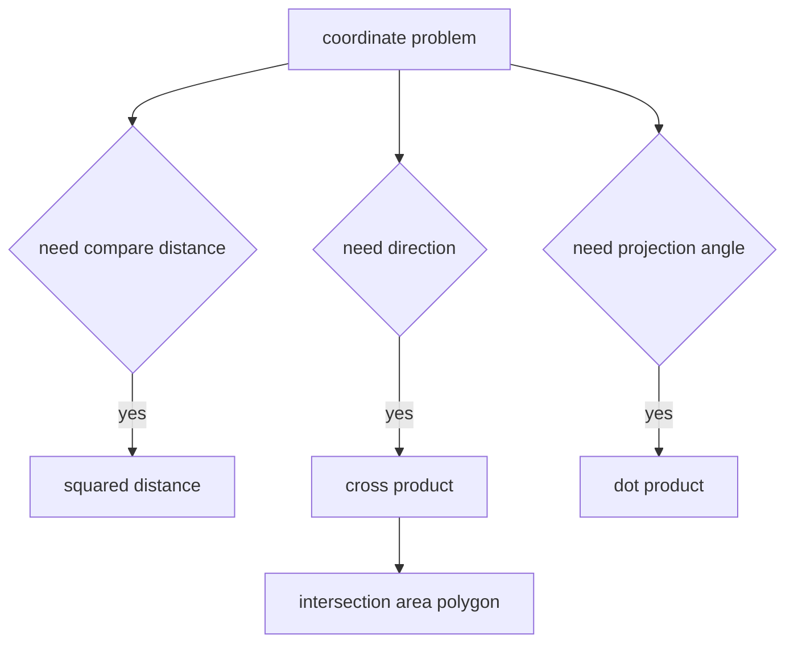

# 27. Coordinate Geometry

> Coordinate Geometry Pattern은 좌표 문제를 거리, 벡터, cross product, dot product로 바꾸는 문제해결 기법이다. 핵심은 floating point를 피하고, 가능한 한 정수 연산으로 관계를 판정하는 것이다.

## 문제 신호

- points, coordinates
- distance, closest, farthest
- line, segment, slope
- rectangle, polygon
- orientation, clockwise, counter-clockwise
- intersection, overlap



## 거리 비교

sqrt를 계산하지 않고 거리 제곱으로 비교한다.

```python
Point = tuple[int, int]


def closest_pair_bruteforce(points: list[Point]) -> tuple[Point, Point] | None:
    if len(points) < 2:
        return None

    best_pair = (points[0], points[1])
    best_dist = squared_distance(points[0], points[1])

    for i in range(len(points)):
        for j in range(i + 1, len(points)):
            dist = squared_distance(points[i], points[j])
            if dist < best_dist:
                best_dist = dist
                best_pair = (points[i], points[j])

    return best_pair


def squared_distance(a: Point, b: Point) -> int:
    dx = a[0] - b[0]
    dy = a[1] - b[1]
    return dx * dx + dy * dy
```

## Orientation Pattern

```python
Point = tuple[int, int]


def cross_of_three(a: Point, b: Point, c: Point) -> int:
    return (b[0] - a[0]) * (c[1] - a[1]) - (b[1] - a[1]) * (c[0] - a[0])


def turn_direction(a: Point, b: Point, c: Point) -> str:
    value = cross_of_three(a, b, c)
    if value > 0:
        return "ccw"
    if value < 0:
        return "cw"
    return "collinear"
```

방향 판정에서 기울기 division을 쓰면 수직선, float 오차, division by zero 문제가 생긴다. cross product가 더 안전하다.

## Rectangle Overlap Pattern

2D overlap은 x축 interval overlap과 y축 interval overlap을 동시에 만족하는지 확인한다.

```python
def rectangle_area_overlap(
    a: tuple[int, int, int, int],
    b: tuple[int, int, int, int],
) -> int:
    ax1, ay1, ax2, ay2 = a
    bx1, by1, bx2, by2 = b

    width = max(0, min(ax2, bx2) - max(ax1, bx1))
    height = max(0, min(ay2, by2) - max(ay1, by1))
    return width * height
```

## Segment Intersection Pattern

선분 교차는 일반 교차와 collinear endpoint case를 분리한다.

```python
Point = tuple[int, int]


def orient(a: Point, b: Point, c: Point) -> int:
    value = (b[0] - a[0]) * (c[1] - a[1]) - (b[1] - a[1]) * (c[0] - a[0])
    return (value > 0) - (value < 0)


def on_segment(a: Point, b: Point, p: Point) -> bool:
    return (
        orient(a, b, p) == 0
        and min(a[0], b[0]) <= p[0] <= max(a[0], b[0])
        and min(a[1], b[1]) <= p[1] <= max(a[1], b[1])
    )


def intersect(a: Point, b: Point, c: Point, d: Point) -> bool:
    o1 = orient(a, b, c)
    o2 = orient(a, b, d)
    o3 = orient(c, d, a)
    o4 = orient(c, d, b)

    if o1 != o2 and o3 != o4:
        return True

    return (
        on_segment(a, b, c)
        or on_segment(a, b, d)
        or on_segment(c, d, a)
        or on_segment(c, d, b)
    )
```

## Polygon Area Pattern

점이 순서대로 주어졌다면 shoelace formula를 사용한다.

```python
Point = tuple[int, int]


def area_twice(points: list[Point]) -> int:
    total = 0
    for i, (x1, y1) in enumerate(points):
        x2, y2 = points[(i + 1) % len(points)]
        total += x1 * y2 - y1 * x2
    return abs(total)
```

## 정렬과 Geometry

좌표 문제는 정렬과 결합되는 경우가 많다.

- x좌표 기준 정렬 후 sweep
- polar angle 기준 정렬
- distance 기준 k closest
- rectangle event sweep
- convex hull에서 x, y 정렬

```python
def sort_points_by_xy(points: list[Point]) -> list[Point]:
    return sorted(points, key=lambda p: (p[0], p[1]))
```

## 실수 방지

- 좌표가 `(row, col)`인지 `(x, y)`인지 구분한다.
- boundary 포함 여부를 명시한다.
- float 비교가 필요하면 tolerance를 둔다.
- slope를 직접 비교하지 말고 cross product를 고려한다.
- 면적이 `.5`가 될 수 있으므로 2배 면적을 정수로 유지하면 안전하다.

## 연결되는 노트

- [Geometry](../02.%20Algorithms/13.%20Geometry.md)
- [Math](../02.%20Algorithms/12.%20Math.md)
- [Matrix](../01.%20Data%20Structures/04.%20Matrix.md)
- [Sweep Line and Intervals](19.%20Sweep%20Line%20and%20Intervals.md)

## References

- [Python 3.14.6 math](https://docs.python.org/3/library/math.html)